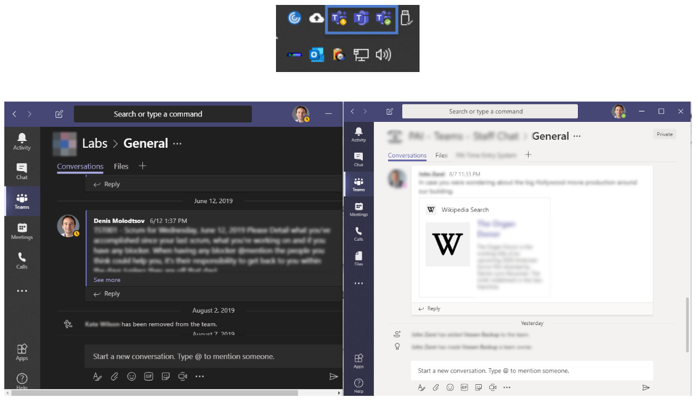

# Multiple Teams Instances
Guide and PowerShell Scripts for running multiple MS Teams instances



## Let's get it working!

The guide assumes you are using Windows 10. But similar steps apply to Windows 8 and 7.

- Press Win key and type `user`. Select "Add, edit, or remove other users"
- Click on "Add someone else to this PC"
- Click on "I don't have this person's sign-in information" > "Add a user without a Microsoft Account"
- Type your new Windows account login and password. I recommend a sim
- Press CTRL+ALT+DEL and click "switch user"
- Login as the newly created Windows user.
- [Download and install the second instance MS Teams.](https://teams.microsoft.com/downloads)
- Now press CTRL+ALT+DEL again > "switch user" > select the original account.
- Open PowerShell console and run the following script:

```
#run as admin 
if (!([Security.Principal.WindowsPrincipal][Security.Principal.WindowsIdentity]::GetCurrent()).IsInRole([Security.Principal.WindowsBuiltInRole] "Administrator")) { Start-Process powershell.exe "-NoProfile -ExecutionPolicy Bypass -File `"$PSCommandPath`"" -Verb RunAs; exit }


$credential = Get-Credential
Start-Process "C:\Users\$($credential.UserName)\AppData\Local\Microsoft\Teams\Update.exe" '--processStart "Teams.exe"' -Credential $credential
```

- When prompted - enter your secondary Windows account that you created earlier.
- Then login to the new MS Teams instance using any account you want. You will now see your second of Teams.
- Done. Enjoy your second Team instance.

## Automate running the second instance

- Option 1 - Run_Teams_Instance_Ask_For_Credentials.bat - you can double-click this script to open a second instance of Teams. Upon running the script, you will be prompted to enter your secondary Windows credentials.
- Option 2 - You can hardcode your secondary Windows account's login and password in the Run_Multiple_Teams_PA.ps1 file
- You can now double-click Run_Multiple_Teams_PA.bat file. Second Teams instance will launch with no credentials prompt.


## Limitations of the approach

- If you need to run 3 instances of Teams - you will need 3 Windows accounts with Teams installed.
- If you run multiple Team instances and use the same Microsoft account - you will receive notifications in all of them. If someone calls you - you will see two incoming calls at the same time.
- Teams is a resource hog. It uses a lot of RAG and processing power.


## Summary

I am looking forward to Microsoft implementing multiple Teams instances natively in order to avoid this workaround. In the meanwhile, this is the only want that works for me.
